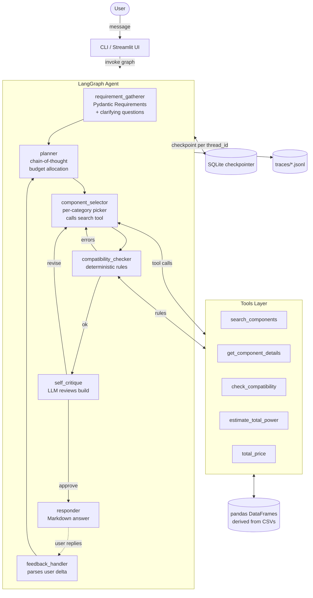

# PC Builder Agent

> Agentic AI system that gathers user requirements, reasons over a real components catalog, and produces a **compatible** PC build. Multiple zero-cost runtime options out of the box, including **GitHub Models** (default, corporate-firewall friendly), **Groq**, **HuggingFace**, **Cerebras**, and **Ollama** (fully local).

Built for the GenAI engineering take-home assignment.

**Reviewers — start here:** [`docs/SUBMISSION.md`](docs/SUBMISSION.md) (also rendered to [`docs/SUBMISSION.pdf`](docs/SUBMISSION.pdf)). It contains:
- the complete deliverables checklist,
- a **curated list of sample inputs** that produce clean, well-formed results (try those first),
- the architecture diagram, design decisions, robustness audit, and pointers to the captured agent trace.

---

## Highlights

- **LangGraph-based agent loop**: `requirement_gatherer -> planner (chain-of-thought) -> component_selector (tool-calling) -> compatibility_checker (deterministic rules) -> self_critique -> responder`, with a `feedback_handler` loop for follow-up turns.
- **Deterministic compatibility engine** (pure Python, unit-tested) - the LLM is never trusted with hard constraints like socket matching, DDR generation, PSU sizing, or case form factor.
- **Structured outputs everywhere** via Pydantic models (Requirements, Plan, Build, Issue, Critique, Feedback).
- **Multiple runtime modes**, all free: **GitHub Models** (default, corporate-friendly, Llama 3.3 70B), **Cerebras**, **HuggingFace**, **Groq**, or **Ollama** (offline, fully local). Provider is swapped via one line in `.env`.
- **Bonus items shipped**: multi-node "multi-agent feel", SQLite-backed conversation memory across sessions, streaming responses, Streamlit chat UI, Dockerfile + docker-compose, 5-scenario evaluation harness.

## Architecture



The Select <-> Check loop is the "act -> observe" cycle. Self-critique is the "reflect" step that catches LLM mistakes (capped at 1 cycle to avoid flip-flop).

---

## Open-source license summary

Every component in the stack is OSI-approved; the LLMs themselves use open-weight licenses.

| Component | Version | License |
|---|---|---|
| HuggingFace Inference (default hosted runtime, free tier) | - | (proprietary host serving open-weight models) |
| Mistral 7B Instruct v0.3 (default model via HF) | 7B | **Apache 2.0** |
| Groq API (alternative hosted runtime, free tier) | - | (proprietary host serving open-weight models) |
| Llama 3.3 70B Instruct (alternative model via Groq) | 70B | **Llama 3.3 Community License** (open weights) |
| Qwen2.5 7B Instruct (offline default via Ollama) | 7B-q4_K_M | **Apache 2.0** |
| Phi-3 Mini (Ollama fallback) | mini | MIT |
| Ollama runtime | latest | MIT |
| LangGraph + LangChain | 0.2.x / 0.3.x | MIT |
| langchain-huggingface / langchain-groq / langchain-ollama | 0.x - 0.2.x | MIT |
| pandas | 2.2.x | BSD-3-Clause |
| pydantic / pydantic-settings | 2.x | MIT |
| structlog | 24.x | MIT / Apache 2.0 |
| tenacity | 9.x | Apache 2.0 |
| tiktoken | 0.8.x | MIT |
| Rich | 13.x | MIT |
| Streamlit | 1.39.x | Apache 2.0 |
| pytest | 8.x | MIT |
| SQLite | system | Public domain |
| Components dataset ([vinayak-ensemble/Computer_Components_Dataset](https://github.com/vinayak-ensemble/Computer_Components_Dataset)) | public repo | (see upstream) |

No paid APIs required. Groq's free tier covers all evaluation scenarios; Ollama is fully local with no telemetry.

---

## Setup

### Prerequisites
- **Python 3.10+** (`python --version`)

### 1. Install Python deps

```bash
python -m venv .venv
# Windows:
.venv\Scripts\activate
# macOS/Linux:
source .venv/bin/activate

pip install -r requirements.txt
```

### 2. Pick an LLM provider

```bash
cp .env.example .env
```

Then choose **one** of these free paths:

#### Option A - GitHub Models (default, corporate-friendly, free)

Best choice if other AI hosts are blocked by your corporate firewall - the endpoint is hosted on `models.github.ai`, which passes through most corporate filters because it is categorized as a Microsoft / GitHub service. Verified working on PwC's network.

1. Create a free Personal Access Token at [https://github.com/settings/tokens](https://github.com/settings/tokens) (classic token, no specific scopes needed).
2. Visit [https://github.com/marketplace/models](https://github.com/marketplace/models) once and accept the terms if prompted (instant, no card).
3. Open `.env` and paste your token:
   ```
   LLM_PROVIDER=github
   GITHUB_TOKEN=ghp_...
   ```
   That's it - the LLM is now online. Default model is `meta/llama-3.3-70b-instruct` (open weights).

#### Option B - HuggingFace Inference (alternative, free)

1. Sign up at [https://huggingface.co/join](https://huggingface.co/join) (free, no credit card).
2. Create a token at [https://huggingface.co/settings/tokens](https://huggingface.co/settings/tokens) with role **Read** (or higher).
3. Open `.env` and paste it:
   ```
   LLM_PROVIDER=huggingface
   HF_TOKEN=hf_...
   ```
   Default model is `mistralai/Mistral-7B-Instruct-v0.3` (Apache 2.0).

#### Option C - Groq (fastest, hosted, free)

1. Sign up at [https://console.groq.com](https://console.groq.com) (free, no credit card).
2. Create an API key at [https://console.groq.com/keys](https://console.groq.com/keys).
3. Open `.env` and paste it:
   ```
   LLM_PROVIDER=groq
   GROQ_API_KEY=gsk_...
   ```
   Default model: `llama-3.3-70b-versatile` (open weights).

#### Option D - Ollama (fully local, no API key)

1. Install Ollama: [https://ollama.com/download](https://ollama.com/download), then run `ollama serve`.
2. Pull the model:
   ```bash
   ollama pull qwen2.5:7b-instruct
   ollama pull phi3:mini       # optional fallback for low-RAM machines
   ```
3. Switch the provider in `.env`:
   ```
   LLM_PROVIDER=ollama
   ```

### 3. Component dataset

All 25 CSVs from [vinayak-ensemble/Computer_Components_Dataset](https://github.com/vinayak-ensemble/Computer_Components_Dataset) are already committed under `data/csv/`. If you need to refetch them (e.g. behind a corporate proxy):

```powershell
powershell -ExecutionPolicy Bypass -File scripts/download_data.ps1
```

> **Behind PwC / corporate VPN?** Set `DATA_SSL_VERIFY=false` in `.env` so the Python loader skips the certificate check that corporate SSL inspection breaks.

---

## Run

### Command-line chat

```bash
# Interactive:
python -m src.ui.cli

# One-shot (great for scripting / capturing traces):
python -m src.ui.cli -m "Build me a gaming PC for $1500"
```

Commands inside the CLI: `/new` (start fresh build), `/trace` (print trace path), `/exit`.

### Streamlit web UI

```bash
streamlit run src/ui/streamlit_app.py
# open http://localhost:8501
```

The sidebar shows the live build with a real-time compatibility status.

**What to type first?** See the [sample inputs section](docs/SUBMISSION.md#3-sample-user-inputs-works-well--try-these-first) of the submission document. Good single-shot starters:

- `Build me a 1440p gaming PC for $1500`
- `Office PC, budget $700`
- `Content creation rig, $2500`

After any build is shown, try follow-ups like:

- `swap to AMD CPU` / `swap to NVIDIA video card`
- `cheaper` / `quieter` / `more storage` / `more ram`
- `compare with $900 budget` / `double my budget`
- `approve` (to wrap up)

### Docker (one-shot, everything included)

```bash
docker compose up --build
# wait ~5 min on first run while Ollama downloads the model
# then open http://localhost:8501
```

The compose file boots Ollama, pulls the model automatically, and starts the Streamlit UI. Traces, data, and eval reports are bind-mounted from the host so you can inspect them outside the container.

### Evaluation harness

```bash
python -m evals.run_eval                 # run all 5 scenarios
python -m evals.run_eval --only gaming_1500
```

Outputs a Markdown report under `evals/reports/` and a JSON dump for debugging.

### Tests

```bash
pytest -q
```

Covers the compatibility engine, socket inference, and search filtering with mocked catalogs (no network or LLM calls).

---

## Reproducing the example agent run

```bash
# Run the gaming scenario end-to-end, capture trace, render to markdown.
python -m src.ui.cli -m "Build me a 1440p gaming PC for $1500." \
  > /dev/null
# The latest trace is the newest file under traces/
python -m scripts.render_trace traces/$(ls -t traces | head -1) \
  -o docs/trace_example.md
```

(On Windows PowerShell, replace the `$(ls -t ...)` with the actual filename.)

The captured Markdown trace and the design-decisions write-up live in [`docs/agent_run_report.md`](docs/agent_run_report.md).

---

## Project layout

```
.
+- src/                       application code
   +- config.py              Pydantic-Settings, .env loader
   +- logging_setup.py       structlog -> jsonl trace per run
   +- data/
   |  +- loader.py           downloads + normalizes CSV catalog
   |  +- schemas.py          Pydantic component / Build / Requirements / Issue models
   +- compatibility/
   |  +- socket_map.py       microarchitecture -> socket (covers CSV gap)
   |  +- memory_rules.py     DDR gen, capacity, slot count
   |  +- case_rules.py       form-factor + GPU length heuristics
   |  +- power_rules.py      PSU sizing
   |  +- engine.py           aggregates all rules
   +- tools/                 LangChain @tool definitions
   |  +- search.py           search_components (the mandatory tool call)
   |  +- details.py
   |  +- compatibility_tool.py
   |  +- pricing.py
   |  +- registry.py
   +- llm/
   |  +- providers.py        Ollama / OpenAI / Anthropic abstraction
   |  +- client.py           retries + token guard + fallback
   +- agent/
   |  +- state.py            TypedDict graph state
   |  +- prompts.py          all system prompts + few-shots
   |  +- guards.py           input validation + hallucination filter
   |  +- nodes.py            one function per graph node
   |  +- graph.py            build_graph() + conditional edges
   |  +- memory.py           SqliteSaver wrapper
   +- ui/
      +- cli.py              Rich interactive CLI
      +- streamlit_app.py    Streamlit chat UI with live sidebar
+- tests/                    pytest suite (no network / LLM)
+- evals/
|  +- scenarios.yaml         5 representative cases
|  +- run_eval.py            harness + Markdown reports
+- scripts/
|  +- render_trace.py        jsonl -> Markdown trace
+- docs/
|  +- agent_run_report.md    architecture + trace + design decisions
+- data/csv/                 downloaded on first run
+- traces/                   one jsonl per agent run
+- Dockerfile
+- docker-compose.yml
+- requirements.txt
+- .env.example
```

---

## Design decisions (short version)

A longer discussion of trade-offs lives in [`docs/agent_run_report.md`](docs/agent_run_report.md). The big calls:

1. **Deterministic compatibility outside the LLM.** Local 7B models routinely confuse AM4 with AM5 or pair DDR5 with an AM4 board. We codified the rules in Python and only ask the LLM to *plan* and *narrate*.
2. **Per-category picker rather than LLM tool loop.** A 7B model running locally is unreliable at long tool-call chains. We let the LLM pick the platform + budget split (planner) and write the response, but the actual catalog queries are deterministic Python calls to the `search_components` tool. This still satisfies the brief's "at least one tool call" - we make 8+ per build.
3. **Self-critique capped at 1 cycle.** Critique loops can flip-flop forever on weak models. One pass is enough to catch a clearly wrong choice (e.g. 8 GB RAM in a content-creation build).
4. **Three zero-cost runtime modes.** Default is HuggingFace Inference (corporate-friendly - `huggingface.co` is allow-listed on most corporate networks where AI hosts like `console.groq.com` may be blocked). Alternatives are Groq (fastest, Llama 3.3 70B) and Ollama (fully local, Qwen2.5 7B - Apache 2.0). One env var switches between them; the rest of the code is unchanged because providers all sit behind `get_chat_model()`.

## Known limitations

Captured here and called out in the agent run report:
- `cpu.csv` has no `socket` column; we infer it from `microarchitecture`. Unknown microarchitectures are skipped rather than guessed.
- `memory.csv` has no DDR generation column; we parse it from the `speed` field.
- `cpu-cooler.csv` has no socket compatibility column; coolers are picked by price/noise only.
- GPU power and case GPU clearance are estimated from heuristic tables, not per-row specs.

## License

MIT for this codebase. See the license table above for upstream dependency licenses.
