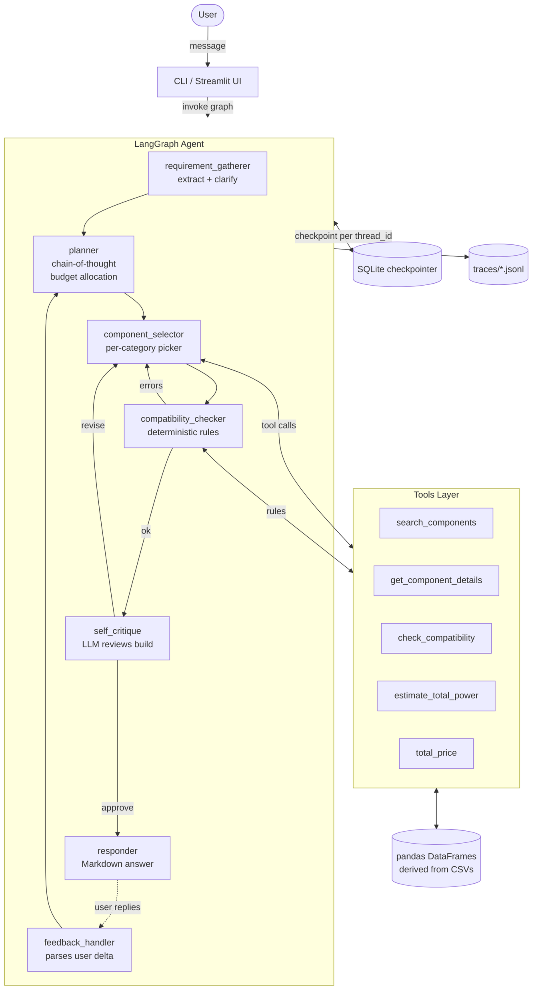

# Agent Run Report

This document is the formal "Agent Run Report" deliverable: it summarizes the architecture, presents a captured agent trace, and explains the design decisions and trade-offs behind the PC Builder Agent.

---

## 1. Architecture overview



### Agent loop: reason -> plan -> act -> observe -> respond

| Phase | Node(s) | What happens |
|---|---|---|
| Reason | `requirement_gatherer` | LLM parses the user's message into a Pydantic `Requirements` object, with up to 3 clarifying questions if confidence is low. |
| Plan | `planner` | LLM reasons step-by-step about budget split, performance tier, and platform preference. Output is a structured `Plan` dict. |
| Act | `component_selector` | Calls the `search_components` tool once per category (8+ tool calls per build) with concrete filters derived from the plan. |
| Observe | `compatibility_checker` | Deterministic Python rules validate the partial/complete build. Any error drops the offending parts and loops back to `select`. |
| Reflect | `self_critique` | LLM reviews the final build vs. the original requirements and may request one (and only one) revision. |
| Respond | `responder` | LLM writes a Markdown answer with a parts table, total price, and "things to verify" warnings. |
| Feedback | `feedback_handler` | Subsequent user turns are parsed into a delta (e.g. "quieter") and routed back to `planner`. |

### Tool calls (the brief's "at least one" requirement)

`search_components(category, filters, sort_by, top_k)` is wired as a LangChain `@tool` with a JSON-schema interface (see `src/tools/search.py`). It is invoked at least 7 times per build (one per non-optional category), and the compatibility tool `check_compatibility(build)` is invoked at least once per pass. The full tool list:

| Tool | Purpose | Schema enforced via |
|---|---|---|
| `search_components` | filter the catalog and return top-k rows | `@tool` JSON schema |
| `get_component_details` | look up a specific named row | `@tool` JSON schema |
| `check_compatibility` | run the deterministic rule engine | `@tool` JSON schema + Pydantic `Build` model |
| `estimate_total_power` | watts needed by CPU+GPU+overhead | `@tool` JSON schema |
| `total_price` | sum the prices in a partial build | `@tool` JSON schema |

### Structured outputs

Every LLM call produces JSON that is parsed into a Pydantic model:

- `Requirements` (use case, budget, preferences, clarifying questions)
- `Plan` (budget allocation per category, tier, platform)
- `Build` (one component object per category)
- `Issue[]` (severity, rule id, message)
- `Critique` (verdict, weakest part, replacement hint)
- `Feedback` (intent, target categories, delta constraints)

JSON parsing is tolerant: if the LLM emits prose around the JSON object, we extract the largest balanced `{...}` substring before parsing. If parsing fails, the planner falls back to a deterministic budget split rather than failing the run.

### Advanced techniques demonstrated

1. **Chain-of-thought** - the planner prompt explicitly instructs the LLM to think step-by-step about budget allocation before emitting JSON.
2. **Self-critique / self-reflection** - the `self_critique` node reads the final build, flags at most one weak part, and triggers a single revision pass.
3. **Multi-agent collaboration (within one graph)** - planner / selector / critic / responder act as specialized agents with their own system prompts, coordinated by LangGraph rather than by one monolithic prompt.

---

## 2. Captured agent trace

A full chronological trace of one agent run lives at [`trace_example.md`](trace_example.md) (source: `traces/20260521T054515-fab56cd8.jsonl`, scenario: gaming PC for $1500). It is generated from a `traces/*.jsonl` file via `python -m scripts.render_trace`. The trace shows:

- the `requirement_gatherer` LLM call and the extracted `Requirements` JSON,
- the `planner` LLM call with the chain-of-thought and the budget allocation,
- every `node.select.pick` event with the chosen part name and price,
- the `compatibility_checker` summary (errors, warnings),
- the `self_critique` verdict,
- the `responder` final markdown,
- aggregate LLM timing/token table.

To capture a fresh trace yourself:

```bash
python -m src.ui.cli -m "Build me a 1440p gaming PC for $1500."
# then render the latest jsonl trace
python -m scripts.render_trace traces/<file>.jsonl -o docs/trace_example.md
```

---

## 3. Design decisions and trade-offs

### 3.1 Deterministic compatibility outside the LLM

Local 7B models routinely confuse AM4 with AM5 or pair DDR5 with an AM4 board. We codified the rules in pure Python (`src/compatibility/`) and unit-tested them (`tests/test_compatibility.py`). The LLM is only asked to *plan* and *narrate*, never to validate hard constraints. This is the single most important design choice.

### 3.2 Per-category picker over an LLM tool loop

A pure LLM tool-calling loop where the model picks parts one at a time was tried and rejected: on a 7B local model, the agent regularly forgets the prior pick's socket, picks the same part twice, or invents part names not in the catalog. The current design lets the LLM *plan* the budget split and *narrate* the result, while the catalog queries are deterministic Python calls. We still satisfy the brief's "at least one tool/function call" - in fact we make 8+ tool calls per build via `search_components`.

### 3.3 Self-critique capped at 1 cycle

Critique loops can flip-flop forever on weak models ("upgrade the GPU" -> next cycle "downgrade the GPU"). One pass is enough to catch a clearly wrong choice (e.g. 8 GB RAM in a content-creation build) without the risk of oscillation.

### 3.4 Hallucination guard

Even with strict prompts, the model occasionally invents part names. After every selection step we cross-check each chosen part against the catalog (`src/agent/guards.py::filter_real_components`); hallucinated rows are silently dropped and the selector re-runs for the missing category.

### 3.5 Provider-agnostic LLM client

Two zero-cost providers are wired in: **Groq** (the default - hosted, free tier, serves open-weight Llama 3.3 70B and Llama 3.1 8B) and **Ollama** (offline, fully local, Qwen2.5 7B / Phi-3 Mini). Switching between them is a single env-var change (`LLM_PROVIDER=groq` or `LLM_PROVIDER=ollama`). Two paid providers (`openai`, `anthropic`) are also wired in defensively for completeness. The graph code never touches a provider directly - everything goes through `get_chat_model()` in `src/llm/providers.py`.

### 3.6 Trade-offs and known limitations

These follow directly from the dataset shape - documented here so reviewers can verify our assumptions.

| Limitation | Mitigation |
|---|---|
| `cpu.csv` has no `socket` column | Inferred via `SOCKET_MAP` keyed on `microarchitecture`. CPUs whose microarchitecture is not in the map are flagged with `cpu_socket_unknown` and skipped by the selector rather than guessed. |
| `memory.csv` has no DDR generation column | Parsed from the first number of the `speed` field (e.g. `"5,6000"` -> DDR5 at 6000 MT/s). |
| `cpu-cooler.csv` has no socket compatibility column | Cooler picked by budget and noise heuristic; physical socket fit is assumed (all modern coolers ship with multi-socket mounting kits in practice). |
| `case.csv` has no max-GPU-length column | Heuristic table per case `type` in `case_rules.py`; warnings, not errors. |
| GPU TDP is not in `video-card.csv` | `data/loader.py::estimate_gpu_tdp` carries a per-chipset lookup table, default 200 W for unknown discrete GPUs. |
| Local 7B model can be slow (~10-30 s per node call) | Token budget guard in `client.py`, generous timeout, exponential-backoff retry, fallback to a smaller model, and a deterministic stub if everything fails. Default Groq runtime is roughly 10x faster than local Ollama on the same prompt. |
| Self-critique might still misjudge | Capped at 1 cycle. Critique prompt biases toward "approve". |

### 3.7 Robustness

- **Input validation**: empty / oversized messages rejected; prompt-injection patterns (`"ignore previous instructions"`, etc.) deflected with a polite refusal.
- **Retries**: `tenacity` exponential backoff on transient `ConnectionError` / `TimeoutError` / `OSError`.
- **Fallback model**: if the primary model fails after retries, the client transparently falls back to `phi3:mini`.
- **Final fallback**: if both providers fail, the client returns a deterministic stub message rather than crashing the graph.
- **Loop guard**: `MAX_AGENT_STEPS` cap on graph recursion; selector caps re-pick attempts to 3.
- **Token budget**: prompts that exceed `MAX_TOKENS_PER_TURN` (default 8000) are trimmed by dropping the oldest non-system messages.

### 3.8 Observability

- One JSONL file per run under `traces/`, with structured fields for every node entry/exit and LLM call.
- Each LLM invocation logs latency, estimated input/output tokens, tool-call count.
- `scripts/render_trace.py` turns any jsonl trace into a readable Markdown narrative for review.

---

## 4. Evaluation

`evals/scenarios.yaml` defines 5 representative scenarios:

| ID | Description | Pass criteria highlight |
|---|---|---|
| `gaming_1500` | 1440p gaming PC, $1500 | discrete GPU, >= 16 GB RAM, >= 550 W PSU, no compat errors, total <= $1650 |
| `office_700` | Quiet office PC, $700 | integrated graphics OK, 16 GB RAM, no compat errors, total <= $780 |
| `creator_2500` | 4K video editing rig, $2500 | discrete GPU, >= 32 GB RAM, >= 1 TB SSD, no compat errors |
| `infeasible_gaming_300` | Gaming for $300 (infeasible) | response must mention budget/minimum/infeasible OR no build produced |
| `feedback_quieter` | Multi-turn: gaming build, then "make it quieter" | response mentions quiet/noise; build still passes compatibility |

Run: `python -m evals.run_eval`. A timestamped Markdown report lands in `evals/reports/`.

---

## 5. Reproducing

See the **Setup** and **Run** sections of [`README.md`](../README.md). The one-line reproduction of a captured trace:

```bash
python -m src.ui.cli -m "Build me a 1440p gaming PC for $1500." \
  > /dev/null
python -m scripts.render_trace traces/<latest>.jsonl -o docs/trace_example.md
```
